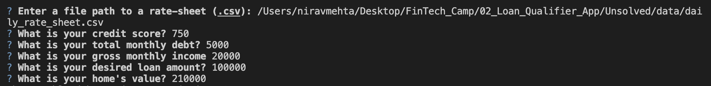

# Loan Qualifier App

This project is an app that allows the user to input financial information, and the app will return a list of banks where the user qualifies for a loan, and offers the user the option of saving this list of loans for which they qualify. Also, if there are no banks for which the user qualifies for a loan, the program terminates.

---

## Technologies

This app was written using python version 3.7 with the following packages:

csv - was used to load, and read through, the csv file containing the criteria to qualify for a loan with various banks.

Path function from pathlib library - allows us to define a variable for the csv file path, which makes it easier to locate and read the csv file daily_rate_sheet.csv. 

fire - was used for the command line interface which creates an entry point for the user to provide information.

questionary - was used to create interactive prompts within the app, allowing the program to communicate with the user. For example, this was used to guide the user through providing information such as thier credit score, monthly debt, monthly income, desired loan amount, and current home value. 

---

## Installation Guide

Please install the following dependencies before running the application: 

```python
pip install fire
pip install questionary
```

---

## Usage

To use the loan qualifier app, first clone the respository to your local environment, and navigate to this folder. Then run the following command in terminal to execute the app. Finally, enter your financial data when prompted to do so.

```python
python app.py
```

These are the prompts the user will see when entering their financial data.


---

## Contributors

Nirav Mehta
nm7293@gmail.com

---

## License

MIT License

Copyright (c) [year] [fullname]

Permission is hereby granted, free of charge, to any person obtaining a copy
of this software and associated documentation files (the "Software"), to deal
in the Software without restriction, including without limitation the rights
to use, copy, modify, merge, publish, distribute, sublicense, and/or sell
copies of the Software, and to permit persons to whom the Software is
furnished to do so, subject to the following conditions:

The above copyright notice and this permission notice shall be included in all
copies or substantial portions of the Software.

THE SOFTWARE IS PROVIDED "AS IS", WITHOUT WARRANTY OF ANY KIND, EXPRESS OR
IMPLIED, INCLUDING BUT NOT LIMITED TO THE WARRANTIES OF MERCHANTABILITY,
FITNESS FOR A PARTICULAR PURPOSE AND NONINFRINGEMENT. IN NO EVENT SHALL THE
AUTHORS OR COPYRIGHT HOLDERS BE LIABLE FOR ANY CLAIM, DAMAGES OR OTHER
LIABILITY, WHETHER IN AN ACTION OF CONTRACT, TORT OR OTHERWISE, ARISING FROM,
OUT OF OR IN CONNECTION WITH THE SOFTWARE OR THE USE OR OTHER DEALINGS IN THE
SOFTWARE.
